# around_frontend
This repo contains frontend code for the Around project.

### Web Functions

#### 1. Register
register

register warning when "confirm password" does not match "password"
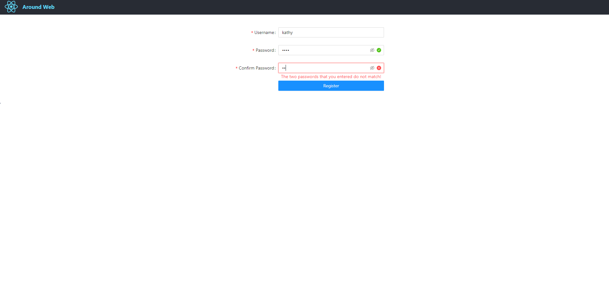

#### 2. Log in
log in
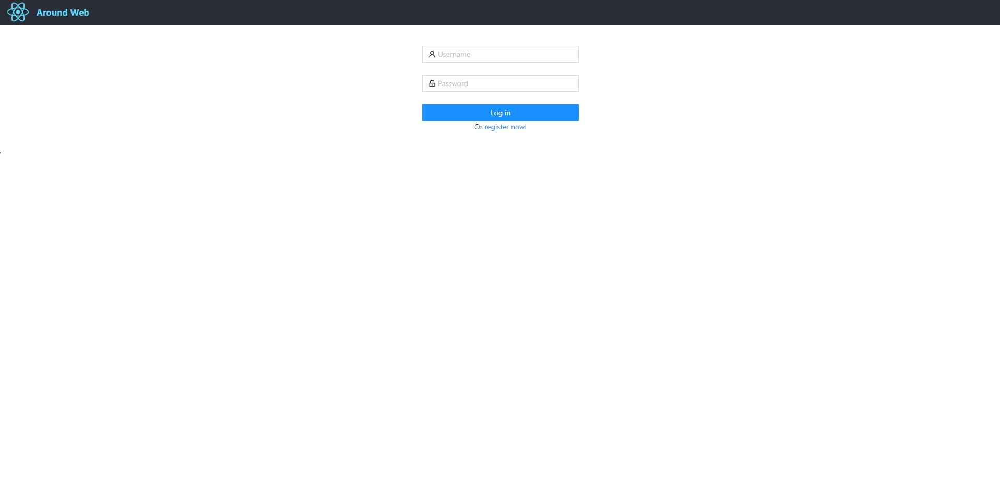
log in warning when input is missing
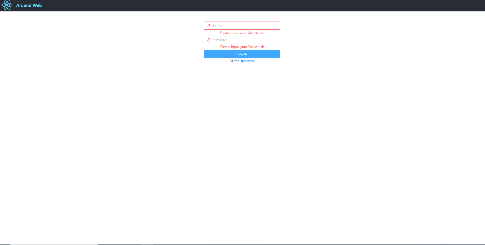

#### 3. Home
After user logging in, the homepage will show. The log-out button is at the upper right corner.

home - images gallery
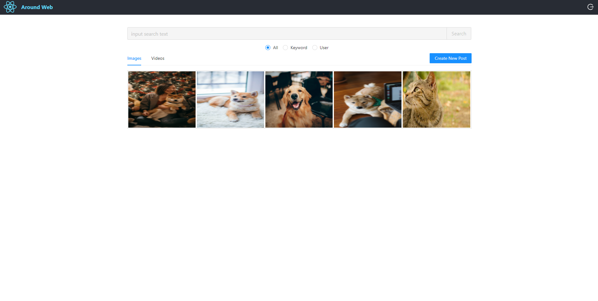
home - when mouse is hovering on an image, the author and message will show.
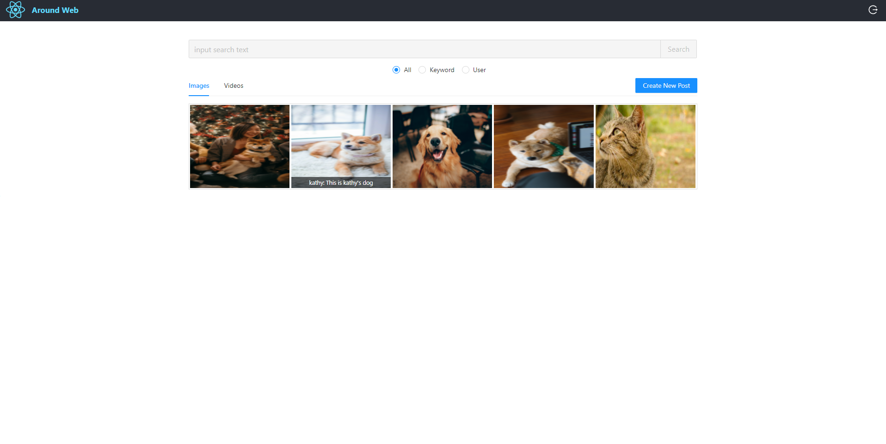
home - videos tab
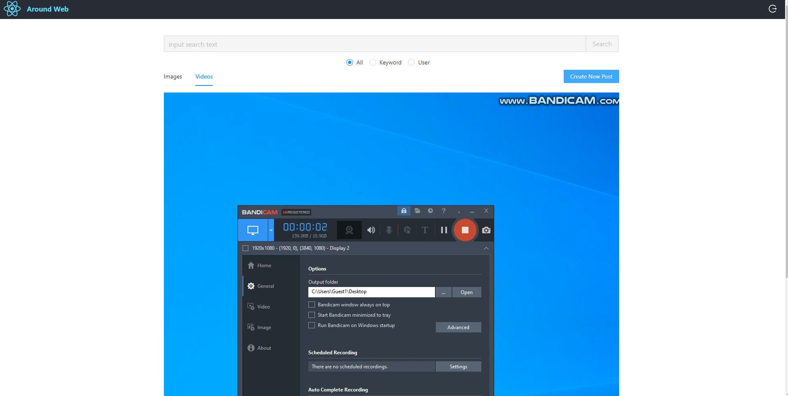

#### 4. Search Posts
The default search option is "All" and all posts will show.

search by keyword
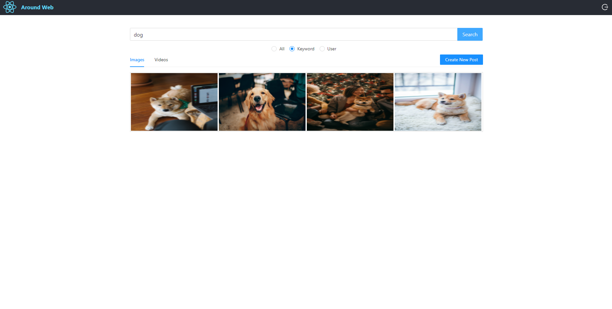
search by keyword warning when the keyword input is missing
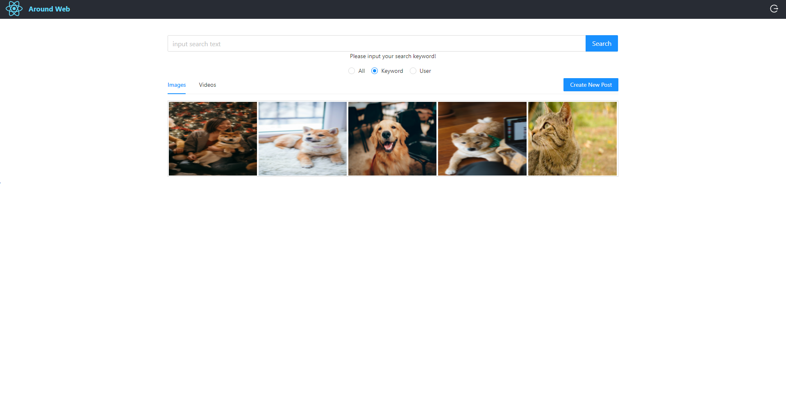
search by user
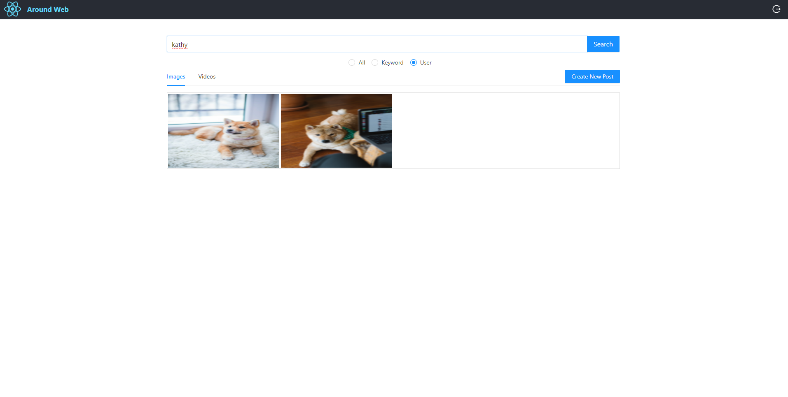

#### 5. Create Post
create a new post

upload image / video with a message
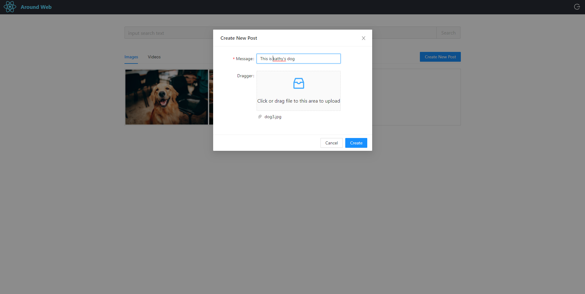

#### 6. Delete Post
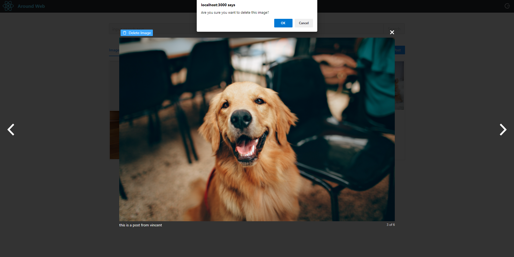
